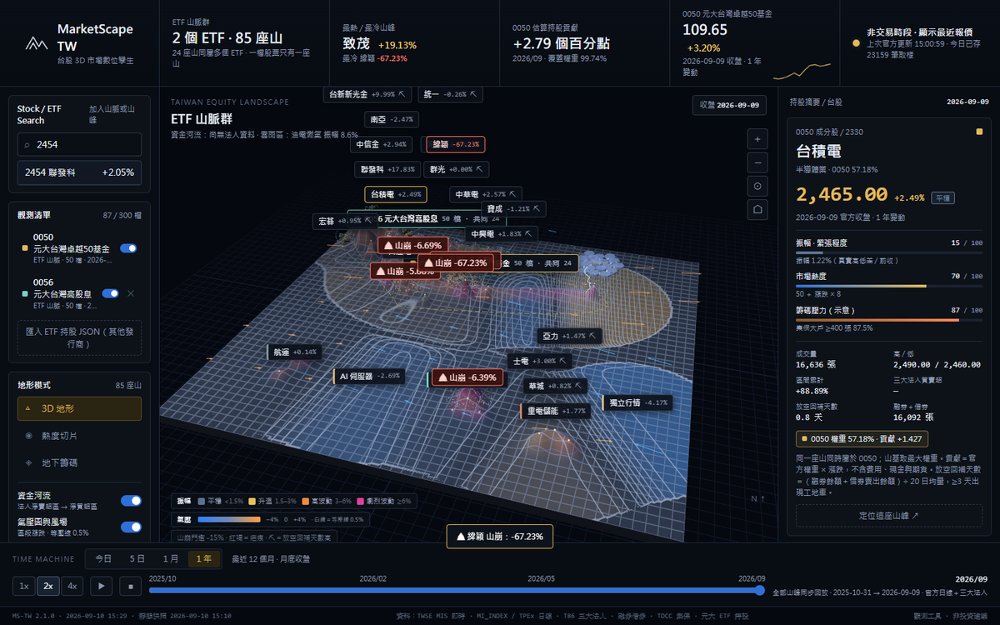

# MarketScape TW v2

**公開展示版：https://ooropuloo.github.io/marketscape-tw/** （靜態快照，加 `?range=1y` 直接看 1 年區段）

[](https://ooropuloo.github.io/marketscape-tw/?range=1y)

台股 3D 市場數位孿生。多個 ETF 各自形成一座山脈群，**一檔股票永遠只有一座山**（共同持股落在山脈群之間），加上 AI 伺服器 / CPO / 重電 / 航運 / 世芯 五個市場區段與自選單股。價格、法人、放空、籌碼全部接官方資料：盤中每 60 秒更新，歷史存 SQLite，Time Machine 可回放今日 / 5 日 / 1 月 / 1 年，跌破門檻的山會山崩。

## 開啟

本機即時版 http://127.0.0.1:5303 （`npm start` 之後）；公開靜態版 https://ooropuloo.github.io/marketscape-tw/ ，見下方「公開展示版」。

畫面 footer 版本字串：`MS-TW 2.1.0 · <build 時間>`（vite build 當下的台北時間）。字串等於最近一次 `npm run build` 的時間就是新版。

```
npm install
npm run build          # 產生 dist/（相對路徑，根目錄與子路徑都能跑）
npm run snapshot       # 把本機 server 的 API 回應匯出到 public/snapshot/（公開靜態版用）
npm run build:static   # 靜態快照模式 build（GitHub Pages 用，不需要 server）
npm start              # 背景啟動 Node server（PID / log 在 .runtime/）
npm run stop
npm run server         # 前景啟動（除錯用）
npm test               # node --test：解析器、報價 fallback、SQLite、佈局、ETF 抓取、法人／放空、universe
npm run verify         # headless Chrome 走完整操作動線（含加入／隱藏／移除 ETF、定位動畫、四區段回放、山崩）
```

- 預設只監聽 127.0.0.1:5303；`HOSTS=127.0.0.1,<其他位址> npm start` 可多綁位址，`PORT=` 可換 port。前端 build 用相對路徑、API 以頁面路徑為基準，同一份 dist 放在根目錄或任何子路徑的反向代理之下都能跑。
- Node 22.12：SQLite 用內建 `node:sqlite`，需要 `--experimental-sqlite`（scripts 已帶）。沒有原生模組。
- **生效條件**：改 `src/` 要 `npm run build`，瀏覽器重新整理即可。改 `server/` 要 `npm run stop && npm start`。不用清 cache。
- DB：`.runtime/marketscape.sqlite`（WAL）。刪掉重啟會重新回填（日線約 3 分鐘、法人／放空約 12 分鐘）。

## 觀測清單：ETF 山脈群與單股

- 搜尋框輸入代碼或名稱。ETF 代碼 → 抓官方持股，長出一座有邊界線、名稱標籤與共同稜線的山脈；股票代碼 → 單獨一座山（地圖南側「自選個股」列）。Enter 直接加入。
- 每個 ETF 有錨點；每檔股票的座標＝它在所屬各 ETF 稜線上位置的權重平均，所以同屬兩個 ETF 的股票落在兩座山脈群中間。座標存 `layout` 表，之後不再移動；新增 ETF 只放新出現的股票，移除時只有沒人共用的山會退場。
- 清單可隱藏／顯示、移除（0050 是預設山脈，只能隱藏）。上限 300 檔（MIS 每 100 檔一個請求）。
- **第一版只支援元大投信的 ETF**（0050、0056、00881、00940…，讀官方頁面內嵌的持股資料）。其他發行商用「匯入 ETF 持股 JSON」：`{"id":"006208","name":"富邦台50","asOf":"2026-09-08","holdings":[{"id":"2330","name":"台積電","weight":57.1}]}`。

## 資料來源與更新節奏

| 資料 | 來源 | 節奏 | 表 |
|---|---|---|---|
| 盤中報價（含五檔買賣價） | TWSE MIS `getStockInfo.jsp` | 交易時段每 60 秒；盤後每 10 分鐘 | `intraday` |
| 日線（存目錄內全部代碼） | TWSE `MI_INDEX` ＋ TPEx `dailyQuotes` | 啟動回填近 45 天＋13 個月月底；每日 15:05 補當日 | `daily_bars` / `trading_days` |
| 三大法人買賣超 | TWSE `T86` ＋ TPEx `insti/dailyTrade` | 跟日線同一批日期 | `institutional` |
| 融券餘額、借券賣出餘額 | TWSE `MI_MARGN`、`TWT93U`；TPEx `margin/balance`、`margin/sbl` | 同上 | `short_interest` |
| 集保股權分散（全市場） | TDCC 開放資料 1-5（週） | 超過 6 天重抓 | `holders` |
| ETF 持股 | 元大官方頁面 Nuxt payload；或手動 JSON | 加入時抓；清單有「重新抓取」API | `etfs` / `etf_holdings` |

MIS 的 `z`（最近成交價）只有該秒有成交才會有值，取價順序：`z` → `pz` → 本 session 保留值 → 買賣中價估計（標示「買賣中價估計」）。

## 畫面元素對應的真實數值

- **山高**：ETF 成分股 `0.3 + √最大權重 × 0.95 + clamp(漲跌, ±10) × 0.35`；單股與市場區段 `2 + 漲跌 × 0.45`；下限 0.15。
- **振幅顏色（緊張程度）**：山體顏色依真實振幅（今日：(今高−今低)/昨收；日線：(高−低)/收盤）分四段——藍灰 <1.5% 平穩、黃 1.5–3% 升溫、橙 3–6% 高波動、紫紅 ≥6% 劇烈波動。地圖左下有數值圖例，右側面板顯示振幅與色標。
- **籌碼壓力**：集保 400 張以上大戶持股比例，標示「示意」。
- **資金河流**：日線區段＝三大法人買賣超 × 收盤價（億），從法人淨賣超最多的區段流向淨買超最多的區段；今日盤中沒有免費法人資料，改用每分鐘增量成交 × 內外盤方向（成交價 ≥ 前一分鐘賣價算主動買、≤ 買價算主動賣），標示「盤中估計」。河寬＝金額，粒子＝方向，河上標「來源 → 目的地 · 金額」。沒有淨賣超／淨買超同時存在時不畫河。
- **氣壓圖與風場**：地形上疊一層區段漲跌的色帶（藍＝下跌、橙＝上漲）與每 0.5% 一條白色等壓線；箭頭方向＝區段漲跌方向、長度＝幅度、顏色跟色帶一致。不是法人買賣超。
- **雲雨區與閃電**：振幅最大的區段；振幅 > 2% 左右開始打閃電。
- **放空工地車**：回補天數＝（融券餘額 + 借券賣出餘額）÷ 20 日均量；≥3 天出現一台挖土機在山邊挖，≥6 天兩台且動作更快。日線資料，盤中不變。
- **山崩**：進入某格時股票跌幅低於門檻（今日／5 日／1 月 −5%，1 年 −15%）：山高下墜、碎石滾落、塵霧與擴散環、紅褐疤痕、鏡頭微震、「山崩」標籤；同時最多 8 座。盤中日跌 −5% 或三分鐘急跌 2% 會記進 `events` 並即時推播。左側「示範山崩」只做視覺。
- **定位動畫**：按「定位這座山峰」或點清單，鏡頭飛過去後山峰出現三圈擴散光環、發光約 2.5 秒，標籤同步閃爍。
- **Time Machine**：拉時間軸時全部山峰、河流、風場、雲雨區同步切換；右側面板只是顯示你點選那檔在那一格的數字。

## 已知限制

- 今日回放只有本站啟動後的取樣；過去日期沒有盤中來源。
- 日線未還原除權息；ETF 歷史成分變更未納入（全區段用目前抓到的持股）。
- 元大以外的 ETF 需手動匯入；ETF 持股不會自動每日重抓（可呼叫 `POST /api/watch/<id>/refresh`）。
- 座標由稜線規則產生，不是 UMAP / HDBSCAN。

欄位與 API 細節見 [docs/data-contract.md](docs/data-contract.md)。

## 公開展示版（GitHub Pages）

https://ooropuloo.github.io/marketscape-tw/ （加 `?range=1y` 直接開 1 年區段，`?stock=2330` 預選個股）

GitHub Pages 只能放靜態檔、沒有 Node server，所以公開版是**靜態快照**：`npm run snapshot` 把本機 server 的 API 回應匯出到 `public/snapshot/*.json`，`npm run build:static`（`vite build --mode static`）把前端切到快照模式——所有 `/api/*` 改讀 `snapshot/*.json`，搜尋在瀏覽器端用 `catalog.json` 過濾，加入／移除／匯入 ETF 一律回「靜態快照無法修改」，不輪詢也不開 SSE。footer 顯示 `MS-TW 2.1.0 · <build 時間> · 靜態快照 <快照時間>`，開頁會跳一次提示。

更新公開版資料：本機 `npm start` 跑著的時候 `npm run snapshot`，commit `public/snapshot/` 並 push 到 `main`；`.github/workflows/pages.yml` 會自動 `npm ci && npm run build:static` 並部署到 Pages（約 1–2 分鐘）。本機即時版完全不受影響，`npm run build` 仍是即時模式；`public/snapshot/` 也會一起被複製進本機 dist，但即時模式不會讀它。
